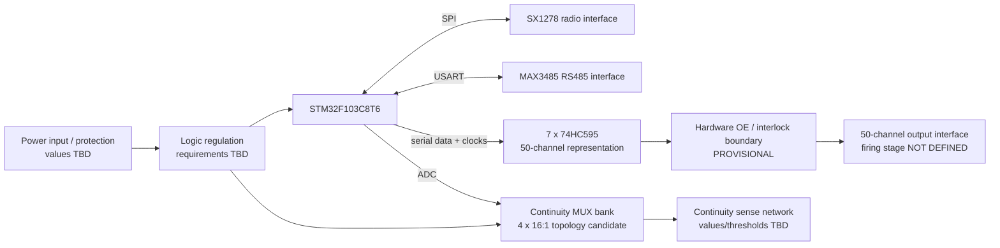

# RX50 Architecture Schematic — PROVISIONAL

**Status:** `PROVISIONAL — NOT RELEASED`

**Purpose:** define the real system-level schematic partition and verified interfaces so schematic capture can proceed without pretending that unresolved hardware requirements are closed.

## 1. Boundary

This document is an architecture schematic, not a build-ready firing circuit. It deliberately excludes firing voltage/current/pulse/energy/skew values, final component values, connector pinout, PCB geometry, and hardware authorization.

## 2. System blocks

## 3. Interface register

| Block | Interface | Status | Evidence / constraint |
|---|---|---|---|
| STM32F103C8T6 | MCU core | FACT / baseline | ST DS5319 |
| SX1278 | SPI + control | PROVISIONAL | Existing RX50 feasibility context |
| MAX3485 | USART/RS485 | PROVISIONAL | Existing RX50 feasibility context |
| 74HC595 chain | SER/SRCLK/RCLK/OE/SRCLR | PROVISIONAL | 7 devices cover 50 bits under documented 1:1 assumption |
| Continuity MUX | 4 x 16:1 candidate | PROVISIONAL | Option A from G4 feasibility |
| ADC sense | STM32 ADC | PROVISIONAL | LQFP48 has up to 10 external ADC channels |
| Output stage | 50 channels | OPEN | No firing-power design or values authorized |
| Safety interlock | OE + independent inhibit concept | OPEN/PROVISIONAL | Multi-channel authorization remains owner/safety decision |

## 4. Provisional resource mapping

The following is an architecture-level allocation only; it is not a locked pin map.

- LoRa candidate: SPI2 PB13/PB14/PB15, NSS PB12, RST PB11, DIO0 PB10.
- RS485 candidate: USART1 PA9/PA10, DE PA8.
- Continuity Option A candidate: ADC PA0–PA3, MUX address PB4–PB7, common enable PB8.
- Shift-register control candidate: SER/SRCLK/RCLK on non-ADC GPIO; exact final assignment remains OPEN.
- SWD: PA13/PA14.

These candidates originate from the existing RX50 feasibility analysis and remain `PROPOSAL`, not `LOCKED`.

## 5. Explicit unresolved items

1. G1 load envelope remains HOLD.
2. G2 firing-power feasibility remains HOLD.
3. CD4067 RON at 3.3 V is not established by datasheet and must not be inferred from 5/10/15 V points.
4. G4 settling/leakage/isolation acceptance remains incomplete.
5. Final multi-channel safety authorization is OPEN.
6. Final connector/pin map is OPEN.
7. Output/firing-stage component values are intentionally absent.

## 6. Schematic progression rule

Architecture may advance with `FACT`, `CALCULATION`, `PROVISIONAL`, `OPEN`, and `TBD` labels. Release/freeze requires the corresponding evidence and owner/safety gates. This document does not close any physical-validation gate.
